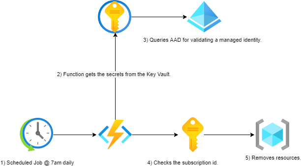

# VICGOV - Azure Resource Cleaner
## 1. Introduction
### 1.1	Overview

A number of challenges arise when managing PoC/test resources in most cost effective way, Hosting Services team have been working to make this process easier to maintain going forward.

This document is intended to provide a high level overview of workflow how the automation cleans up the test resources so that the overall cost for the shared environment stays under the budget.

Included in this report is a step by step detailed guide around where to look for troubleshooting.

## 2 Logical Architecture
### 2.1	Logical System Component Overview

1. Scheduled Job @ 7am daily.
2. Function retreives the secrets from the Keyvault.
3. Queries AAD for validating managed identity.
4. Checks the subscription guid.
5. Iterate through the list of resource groups and removes resources.