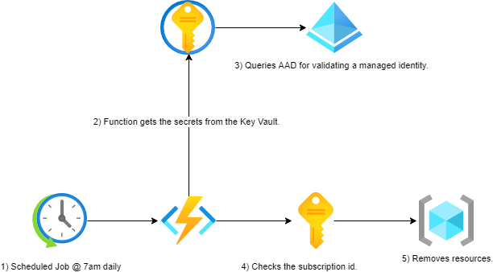

# VICGOV1UAT - GSPSandpit01 Resource Cleaner
## 1. Introduction
### 1.1	Overview

A number of challenges arise when managing PoC/test resources in most cost effective way, Hosting Services team have been working to make this process easier to maintain going forward.

This document is intended to provide a high level overview of workflow how the automation cleans up the test resources so that the overall cost for the shared environment stays under the budget.

Included in this report is a step by step detailed guide around where to look for troubleshooting.


## 2 Logical Architecture
### 2.1	Logical System Component Overview



## 3 Source Code
### 3.1 __init__.py
```python
import logging
import os

import azure.functions as func
import requests


def get_rest_api_token():
    oauth2_headers = {"Content-Type": "application/x-www-form-urlencoded"}
    oauth2_body = {
        "client_id": os.environ["REST_CLIENT_ID"],
        "client_secret": os.environ["REST_CLIENT_SECRET"],
        "grant_type": "client_credentials",
        "resource": "https://management.azure.com",
    }
    oauth2_url = (
        f"https://login.microsoftonline.com/{os.environ['TENANT_ID']}/oauth2/token"
    )
    try:
        return requests.post(
            url=oauth2_url, headers=oauth2_headers, data=oauth2_body
        ).json()["access_token"]
    except Exception as e:
        logging.info(f"{e}")


def get_rest_api_headers(token):
    return {
        "Authorization": "Bearer " + token,
        "Content-Type": "application/json",
    }


def main(mytimer: func.TimerRequest) -> None:
    logging.info("******* Starting the function *******")
    rest_api_headers = get_rest_api_headers(get_rest_api_token())
    try:
        logging.info(
            [
                requests.delete(
                    url=f"https://management.azure.com/subscriptions/{os.environ['SUBSCRIPTION_ID']}/resourcegroups/{rg['name']}?api-version=2020-06-01",
                    headers=rest_api_headers,
                )
                for rg in requests.get(
                    url=f"https://management.azure.com/subscriptions/{os.environ['SUBSCRIPTION_ID']}/resourcegroups?api-version=2020-06-01",
                    headers=rest_api_headers,
                ).json()["value"]
            ]
        )
    except Exception as e:
        logging.info(f"{e}")


```
### 3.2 function.json
```json
{
  "scriptFile": "__init__.py",
  "bindings": [
    {
      "name": "mytimer",
      "type": "timerTrigger",
      "direction": "in",
      "schedule": "0 0 20 * * *"
    }
  ]
}
```
